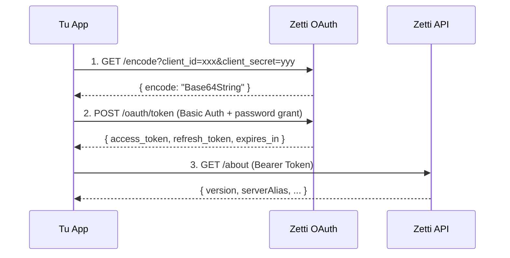
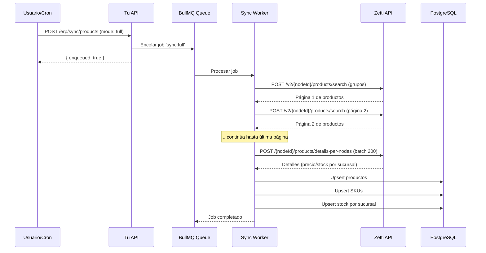
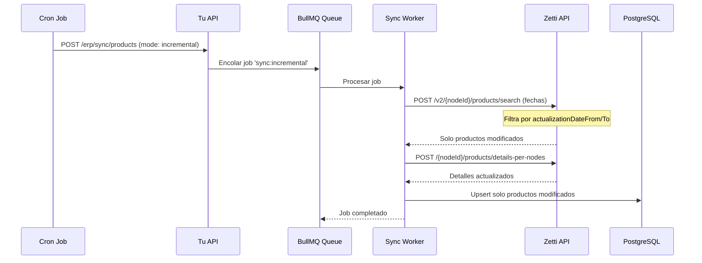

# 🔗 Integración Completa con API Zetti - Documentación Exhaustiva

## 📚 Fuentes de Información

**Documentación Oficial Zetti:**  
https://sites.google.com/zetti.com.ar/api-rest-docum-externos/

**Swagger de la API (Demo):**  
https://demo.zetti.com.ar/api-rest/swagger-ui/index.html

---

## 📋 Índice

1. [Introducción al Sistema Zetti](#introducción)
2. [Modelo Jerárquico de Nodos](#modelo-jerárquico)
3. [Autenticación OAuth 2.0](#autenticación)
4. [Estado Actual de la Implementación](#estado-actual)
5. [Endpoints Implementados](#endpoints-implementados)
6. [Endpoints Pendientes](#endpoints-pendientes)
7. [Configuración y Variables de Entorno](#configuración)
8. [Flujo Completo de Sincronización](#flujo-sincronización)
9. [Ejemplos Prácticos](#ejemplos-prácticos)
10. [Troubleshooting](#troubleshooting)

---

## 🎯 Introducción

### ¿Qué es Zetti?

Zetti es un **sistema ERP (Enterprise Resource Planning)** diseñado específicamente para farmacias y cadenas de farmacias. Proporciona:

- 📦 **Gestión de productos y catálogo**
- 💰 **Control de precios por sucursal**
- 📊 **Stock en tiempo real**
- 📄 **Facturación y comprobantes**
- 👥 **Gestión de clientes**
- 🔄 **Trazabilidad ANMAT**
- 🏪 **Gestión de compras y proveedores**

### Arquitectura de la API

La API de Zetti sigue los principios **REST** y utiliza:

- ✅ **Formato:** JSON para intercambio de datos
- ✅ **Autenticación:** OAuth 2.0
- ✅ **Métodos HTTP:** GET, POST, PUT, DELETE
- ✅ **Documentación:** Swagger/OpenAPI
- ✅ **Versionado:** URLs con versión (ej: `/v2/`)

---

## 🏗️ Modelo Jerárquico de Nodos

### Estructura de Nodos

Zetti organiza los datos en una **estructura jerárquica de tres niveles**:

```
┌─────────────────────────────────────┐
│        NODO GRUPO                   │  ← Nivel más alto (1 por cliente)
│        ID: ZETTI_NODE_GRUPO         │
│        (Control centralizado)       │
└──────────────┬──────────────────────┘
               │
               ├────────────────────────┐
               │                        │
      ┌────────▼────────┐      ┌───────▼────────┐
      │  NODO SOCIEDAD  │      │ NODO SOCIEDAD  │  ← División/Región
      │    (División)   │      │   (División)   │
      └────────┬────────┘      └────────┬───────┘
               │                        │
        ┏━━━━━━┻━━━━━━┓          ┏━━━━━┻━━━━━┓
        ┃             ┃          ┃           ┃
   ┌────▼─────┐  ┌───▼──────┐  ┌▼───────┐  ┌▼────────┐
   │ Farmacia │  │ Farmacia │  │Farmacia│  │Farmacia │  ← Sucursales
   │   001    │  │   002    │  │  003   │  │  004    │
   └──────────┘  └──────────┘  └────────┘  └─────────┘
```

### Importancia de los Nodos

**Cada endpoint de Zetti requiere especificar el nodo** en la URL:

```
GET  https://demo.zetti.com.ar/api-rest/{nodeId}/products/search
POST https://demo.zetti.com.ar/api-rest/v2/{nodeId}/products/search
POST https://demo.zetti.com.ar/api-rest/{nodeId}/products/details-per-nodes
```

**Regla general:**
- **ZETTI_NODE_GRUPO**: Se usa para la mayoría de endpoints (búsquedas, catálogo)
- **ZETTI_NODE_FARMACIA**: Se usa para obtener detalles específicos de stock/precio por sucursal

---

## 🔐 Autenticación OAuth 2.0

### Flujo de Autenticación

La API usa **OAuth 2.0 con Password Grant**:



### Paso 1: Obtener Encode

**Endpoint:** `GET /oauth-server/encode`

```bash
curl "https://demo.zetti.com.ar/oauth-server/encode?client_id=YOUR_CLIENT_ID&client_secret=YOUR_SECRET"
```

**Respuesta:**
```json
{
  "encode": "Y2xpZW50X2lkOmNsaWVudF9zZWNyZXQ="
}
```

### Paso 2: Obtener Access Token

**Endpoint:** `POST /oauth-server/oauth/token`

```bash
curl -X POST "https://demo.zetti.com.ar/oauth-server/oauth/token" \
  -H "Authorization: Basic YOUR_ENCODE_HERE" \
  -H "Content-Type: application/x-www-form-urlencoded" \
  -d "grant_type=password&username=YOUR_USERNAME&password=YOUR_PASSWORD"
```

**Respuesta:**
```json
{
  "access_token": "eyJhbGciOiJSUzI1NiIsInR5cCI6IkpXVCJ9...",
  "token_type": "bearer",
  "refresh_token": "eyJhbGciOiJSUzI1NiIsInR5cCI6IkpXVCJ9...",
  "expires_in": 3600,
  "scope": "read write"
}
```

### Paso 3: Refresh Token (cuando expira)

**Endpoint:** `POST /oauth-server/oauth/token`

```bash
curl -X POST "https://demo.zetti.com.ar/oauth-server/oauth/token" \
  -H "Authorization: Basic YOUR_ENCODE_HERE" \
  -H "Content-Type: application/x-www-form-urlencoded" \
  -d "grant_type=refresh_token&refresh_token=YOUR_REFRESH_TOKEN"
```

### Gestión Automática en Tu Implementación

Tu clase `ZettiClient` **gestiona automáticamente**:

✅ Obtención inicial del encode  
✅ Obtención del access token  
✅ Renovación automática antes de expirar (60s antes)  
✅ Refresh token cuando es necesario  
✅ Retry en caso de 401/403  
✅ Rate limiting (respeta QPS configurado)

```typescript
// Tu código - Uso simple
const client = new ZettiClient();
const about = await client.about(); // ¡Se autentica automáticamente!
```

---

## ✅ Estado Actual de la Implementación

### Endpoints OAuth - ✅ IMPLEMENTADOS

| Método | Endpoint | Implementación | Estado |
|--------|----------|----------------|--------|
| GET | `/oauth-server/encode` | `getEncodeCredentials()` | ✅ |
| POST | `/oauth-server/oauth/token` (password) | `tokenWithPassword()` | ✅ |
| POST | `/oauth-server/oauth/token` (refresh) | `tokenWithRefresh()` | ✅ |

**Ubicación:** `apps/api/src/erp-sync/zetti.client.ts`

### Endpoints API Principal - ✅ IMPLEMENTADOS

| Método | Endpoint | Implementación | Uso | Estado |
|--------|----------|----------------|-----|--------|
| GET | `/about` | `about()` | Verificar servidor y versión | ✅ |
| GET | `/user/me/permissions/{nodeId}` | `userPermissions(nodeId)` | Validar permisos | ✅ |
| POST | `/v2/{nodeId}/products/search` | `searchProductsByGroup()` | Búsqueda por grupos | ✅ |
| POST | `/v2/{nodeId}/products/search` | `searchProductsByActualization()` | Búsqueda incremental | ✅ |
| POST | `/{nodeId}/products/details-per-nodes` | `detailsPerNodes()` | Stock y precios | ✅ |

### Flujo de Sincronización - ✅ IMPLEMENTADO

| Componente | Función | Estado |
|------------|---------|--------|
| **ZettiClient** | Cliente HTTP con OAuth | ✅ |
| **SyncService** | Lógica de sincronización | ✅ |
| **SyncProcessor** | Jobs de BullMQ | ✅ |
| **SyncController** | Endpoints HTTP | ✅ |
| **Entities** | ErpProduct, ErpSku, ErpBranchStock | ✅ |
| **Rate Limiting** | Throttling de requests | ✅ |
| **Error Handling** | Retry automático | ✅ |

---

## 🚀 Endpoints Implementados - Detalle

### 1. About - Verificar Servidor

**Endpoint:** `GET /about`  
**Requiere Auth:** ❌ NO  
**Uso:** Health check y verificar versión

```typescript
// En tu código
const about = await zettiClient.about();

// Respuesta
{
  "version": "3.5.0",
  "construccion": "2025-05-06T17:59:45Z",
  "serverAlias": "BETA -> DEMO",
  "commit": "df26990ee658cb77dee6648d10d64189d7ea6289",
  "branch": "release"
}
```

**Endpoint expuesto:**
```bash
GET http://localhost:3002/api/erp/health
```

### 2. User Permissions - Validar Permisos

**Endpoint:** `GET /user/me/permissions/{nodeId}`  
**Requiere Auth:** ✅ SÍ (Bearer Token)  
**Uso:** Verificar permisos del usuario en un nodo

```typescript
// En tu código
const perms = await zettiClient.userPermissions(ZETTI_NODE_GRUPO);

// Respuesta
{
  "permissions": [
    "READ_PRODUCTS",
    "WRITE_PRODUCTS",
    "READ_STOCK",
    "WRITE_STOCK"
  ]
}
```

**Endpoint expuesto:**
```bash
GET http://localhost:3002/api/erp/permissions/:nodeId
```

### 3. Search Products - Búsqueda por Grupos

**Endpoint:** `POST /v2/{nodeId}/products/search`  
**Requiere Auth:** ✅ SÍ  
**Uso:** Obtener listado de productos por grupos (sincronización completa)

```typescript
// En tu código
const page = await zettiClient.searchProductsByGroup(
  ZETTI_NODE_GRUPO,
  [2], // IDs de grupos (ej: 2 = medicamentos)
  0,   // página
  500  // tamaño
);

// Respuesta
{
  "content": [
    {
      "id": "12345",
      "name": "IBUPROFENO 400MG",
      "brand": "Bayer",
      "category": "Analgésicos",
      "externalId": "ERP-12345"
    }
  ],
  "page": 0,
  "size": 500,
  "totalPages": 5,
  "totalElements": 2341
}
```

**Endpoint expuesto:**
```bash
POST http://localhost:3002/api/erp/sync/products
Content-Type: application/json

{
  "mode": "full",
  "groups": [2]
}
```

### 4. Search Products - Búsqueda Incremental

**Endpoint:** `POST /v2/{nodeId}/products/search`  
**Requiere Auth:** ✅ SÍ  
**Uso:** Obtener productos actualizados en un rango de fechas

```typescript
// En tu código
const page = await zettiClient.searchProductsByActualization(
  ZETTI_NODE_GRUPO,
  "2025-10-01", // desde
  "2025-10-02", // hasta
  0,
  500
);

// Body enviado a Zetti
{
  "actualizationDateFrom": "2025-10-01",
  "actualizationDateTo": "2025-10-02",
  "page": 0,
  "size": 500
}
```

**Endpoint expuesto:**
```bash
POST http://localhost:3002/api/erp/sync/products
Content-Type: application/json

{
  "mode": "incremental",
  "from": "2025-10-01",
  "to": "2025-10-02"
}
```

### 5. Details Per Nodes - Stock y Precios

**Endpoint:** `POST /{nodeId}/products/details-per-nodes`  
**Requiere Auth:** ✅ SÍ  
**Uso:** Obtener precios y stock de productos específicos en farmacias específicas

```typescript
// En tu código
const details = await zettiClient.detailsPerNodes(
  ZETTI_NODE_GRUPO,
  ["FARMACIA_001", "FARMACIA_002"], // IDs de farmacias
  ["12345", "67890"] // IDs de productos
);

// Respuesta
{
  "items": [
    {
      "nodeId": "FARMACIA_001",
      "productId": "12345",
      "skuId": "SKU-12345-001",
      "price": 850.50,
      "currency": "ARS",
      "stock": 150,
      "stockReserved": 10
    },
    {
      "nodeId": "FARMACIA_002",
      "productId": "12345",
      "skuId": "SKU-12345-001",
      "price": 850.50,
      "currency": "ARS",
      "stock": 85,
      "stockReserved": 5
    }
  ]
}
```

**Procesamiento automático:**
Tu `SyncService` procesa esto y lo guarda en:
- `erp_products` - Producto
- `erp_skus` - SKU del producto
- `erp_branch_stock` - Stock y precio por sucursal

---

## 🔮 Endpoints Pendientes de Implementar

Según la documentación oficial de Zetti, hay más integraciones disponibles:

### 📦 Integraciones Principales

| Módulo | Endpoints Disponibles | Prioridad | Estado |
|--------|----------------------|-----------|--------|
| **Comprobantes de Venta** | Crear/consultar facturas | 🔴 Alta | ⏳ Pendiente |
| **ABM de Clientes** | Crear/editar clientes | 🟡 Media | ⏳ Pendiente |

### 🔧 Operaciones Adicionales

| Módulo | Endpoints Disponibles | Prioridad | Estado |
|--------|----------------------|-----------|--------|
| **Ajustes de Stock** | Modificar stock manualmente | 🟡 Media | ⏳ Pendiente |
| **Inventarios** | Gestión de inventarios | 🟢 Baja | ⏳ Pendiente |
| **Pedidos a Proveedor** | Gestionar pedidos | 🟢 Baja | ⏳ Pendiente |
| **Facturas de Compra** | Registrar compras | 🟢 Baja | ⏳ Pendiente |
| **Carga de Mercadería** | Ingreso de mercadería | 🟢 Baja | ⏳ Pendiente |
| **Trazabilidad ANMAT** | Datos de trazabilidad | 🟡 Media | ⏳ Pendiente |
| **Gestión de Proveedores** | ABM de proveedores | 🟢 Baja | ⏳ Pendiente |
| **Listas de Precios** | Consultar precios | 🟡 Media | ⏳ Pendiente |

### Endpoints Recomendados para Próximos Sprints

#### 1. Comprobantes de Venta (Prioridad Alta)

**¿Por qué es importante?**
Para registrar las ventas del ecommerce en Zetti y generar facturación.

**Endpoints sugeridos:**
```typescript
// POST /{nodeId}/sales/invoice
createInvoice(nodeId: string, invoice: InvoiceData)

// GET /{nodeId}/sales/invoice/{id}
getInvoice(nodeId: string, invoiceId: string)
```

#### 2. ABM de Clientes (Prioridad Media)

**¿Por qué es importante?**
Para sincronizar clientes del ecommerce con Zetti.

**Endpoints sugeridos:**
```typescript
// POST /{nodeId}/customers
createCustomer(nodeId: string, customer: CustomerData)

// PUT /{nodeId}/customers/{id}
updateCustomer(nodeId: string, customerId: string, customer: CustomerData)

// GET /{nodeId}/customers/{id}
getCustomer(nodeId: string, customerId: string)
```

#### 3. Trazabilidad ANMAT (Prioridad Media)

**¿Por qué es importante?**
Obligatorio para productos con receta y control de ANMAT.

**Endpoints sugeridos:**
```typescript
// GET /{nodeId}/traceability/anmat/{productId}
getAnmatData(nodeId: string, productId: string)
```

---

## ⚙️ Configuración y Variables de Entorno

### Variables Requeridas en `apps/api/.env`

```bash
# URLs Base de Zetti
ZETTI_API_BASE=https://demo.zetti.com.ar/api-rest
ZETTI_OAUTH_BASE=https://demo.zetti.com.ar/oauth-server

# Credenciales OAuth (proporcionadas por Zetti)
ZETTI_CLIENT_ID=tu_client_id_aqui
ZETTI_CLIENT_SECRET=tu_client_secret_aqui
ZETTI_USERNAME=tu_usuario
ZETTI_PASSWORD=tu_password

# Nodos (IDs proporcionados por Zetti)
ZETTI_NODE_GRUPO=2350520              # ID del nodo grupo
ZETTI_NODE_FARMACIA=2350521           # ID del nodo farmacia principal

# Configuración de Sincronización
ZETTI_GROUP_IDS=2                     # IDs de grupos de productos (separados por coma)
ZETTI_PAGE_SIZE=500                   # Tamaño de página para búsquedas
ZETTI_RATE_LIMIT_QPS=8                # Queries por segundo (rate limiting)
```

### ¿Cómo Obtener tus Credenciales?

1. **Contactar a Zetti** - Solicitar acceso a la API
2. **Recibir credenciales**:
   - `client_id`
   - `client_secret`
   - `username`
   - `password`
3. **Obtener IDs de nodos**:
   - Zetti te proporcionará los IDs específicos de tu estructura
4. **Configurar en `.env`**

### Diferencias entre Entornos

| Ambiente | URL Base | Uso |
|----------|----------|-----|
| **DEMO** | `https://demo.zetti.com.ar` | ✅ Pruebas y desarrollo |
| **PRODUCCIÓN** | `https://tu-farmacia.com:8080` o IP pública | ⚠️ Producción real |

**Importante:** En producción, la URL será específica de tu cliente (DNS o IP pública).

---

## 🔄 Flujo Completo de Sincronización

### Sincronización Completa (Full Load)

**Cuándo usarla:** Primera sincronización o cuando necesitas recargar todo el catálogo.



**Ejemplo de uso:**

```bash
# Primera sincronización
curl -X POST http://localhost:3002/api/erp/sync/products \
  -H "Content-Type: application/json" \
  -d '{
    "mode": "full",
    "groups": [2]
  }'
```

**Respuesta:**
```json
{
  "enqueued": true
}
```

### Sincronización Incremental

**Cuándo usarla:** Sincronización periódica (diaria, cada hora) para actualizar solo cambios.



**Ejemplo de uso (sincronización del día anterior):**

```bash
curl -X POST http://localhost:3002/api/erp/sync/products \
  -H "Content-Type: application/json" \
  -d '{
    "mode": "incremental",
    "from": "2025-10-01",
    "to": "2025-10-02"
  }'
```

### Configurar Sincronización Automática

**Opción 1: Cron en el servidor**

```bash
# Crontab - Sincronización incremental cada hora
0 * * * * curl -X POST http://localhost:3002/api/erp/sync/products \
  -H "Content-Type: application/json" \
  -d "{\"mode\":\"incremental\",\"from\":\"$(date -d '1 hour ago' +\%Y-\%m-\%d\T\%H:00:00)\",\"to\":\"$(date +\%Y-\%m-\%d\T\%H:00:00)\"}"
```

**Opción 2: NestJS Scheduler (RECOMENDADO)**

```typescript
// apps/api/src/erp-sync/sync.scheduler.ts
import { Injectable } from '@nestjs/common';
import { Cron, CronExpression } from '@nestjs/schedule';
import { InjectQueue } from '@nestjs/bullmq';
import { Queue } from 'bullmq';
import { ERP_QUEUE } from './erp-sync.module';

@Injectable()
export class SyncScheduler {
  constructor(@InjectQueue(ERP_QUEUE) private readonly queue: Queue) {}

  // Cada hora
  @Cron(CronExpression.EVERY_HOUR)
  async syncIncremental() {
    const now = new Date();
    const oneHourAgo = new Date(now.getTime() - 60 * 60 * 1000);
    
    await this.queue.add('sync:incremental', {
      mode: 'incremental',
      from: oneHourAgo.toISOString(),
      to: now.toISOString()
    });
  }

  // Todos los días a las 3 AM (sincronización completa)
  @Cron('0 3 * * *')
  async syncFull() {
    const groups = String(process.env.ZETTI_GROUP_IDS ?? '2')
      .split(',')
      .map(x => Number(x.trim()));
    
    await this.queue.add('sync:full', {
      mode: 'full',
      groups
    });
  }
}
```

---

## 💡 Ejemplos Prácticos

### Ejemplo 1: Verificar Conexión con Zetti

```bash
# Health check (no requiere auth)
curl http://localhost:3002/api/erp/health

# Respuesta
{
  "ok": true,
  "about": {
    "version": "3.5.0",
    "serverAlias": "DEMO",
    "construccion": "2025-05-06T17:59:45Z"
  }
}
```

### Ejemplo 2: Verificar Permisos del Usuario

```bash
# Reemplazar {nodeId} con tu ZETTI_NODE_GRUPO
curl http://localhost:3002/api/erp/permissions/2350520

# Respuesta
{
  "permissions": [
    "READ_PRODUCTS",
    "WRITE_PRODUCTS",
    "READ_STOCK"
  ]
}
```

### Ejemplo 3: Sincronización Completa de Productos

```bash
# Sincronización completa
curl -X POST http://localhost:3002/api/erp/sync/products \
  -H "Content-Type: application/json" \
  -d '{
    "mode": "full",
    "groups": [2]
  }'

# Respuesta inmediata
{
  "enqueued": true
}

# El proceso se ejecuta en background (BullMQ)
# Puedes monitorear los logs
```

### Ejemplo 4: Sincronización Incremental (Últimas 24 Horas)

```bash
curl -X POST http://localhost:3002/api/erp/sync/products \
  -H "Content-Type: application/json" \
  -d '{
    "mode": "incremental",
    "from": "2025-10-01T00:00:00",
    "to": "2025-10-02T00:00:00"
  }'
```

### Ejemplo 5: Consultar Productos Sincronizados

```typescript
// En tu código de NestJS
import { Repository } from 'typeorm';
import { ErpProduct } from './domain/erp_product.entity';

// Buscar producto por ID externo (de Zetti)
const product = await this.erpProducts.findOne({
  where: { externalId: '12345' },
  relations: ['skus', 'images']
});

// Buscar SKU con stock por sucursal
const sku = await this.erpSkus.findOne({
  where: { externalId: 'SKU-12345-001' },
  relations: ['product', 'branchStock']
});

// Stock disponible en una farmacia específica
const stock = await this.branchStock.findOne({
  where: {
    sku: { externalId: 'SKU-12345-001' },
    branchId: 'FARMACIA_001'
  },
  relations: ['sku', 'sku.product']
});

console.log(`Stock disponible: ${stock.stock - stock.stockReserved}`);
```

---

## 🐛 Troubleshooting

### Error: "Cannot connect to Zetti API"

**Síntomas:**
```
Error: connect ECONNREFUSED ...
```

**Causas y soluciones:**

1. **URL incorrecta en `.env`**
   ```bash
   # Verificar
   echo $ZETTI_API_BASE
   
   # Para DEMO debe ser:
   ZETTI_API_BASE=https://demo.zetti.com.ar/api-rest
   ```

2. **Firewall bloqueando conexión**
   ```bash
   # Probar conectividad
   curl https://demo.zetti.com.ar/api-rest/about
   ```

3. **Servidor Zetti caído**
   ```bash
   # Verificar estado
   curl -I https://demo.zetti.com.ar/api-rest/about
   ```

### Error: "Invalid credentials" / 401 Unauthorized

**Síntomas:**
```json
{
  "error": "unauthorized",
  "error_description": "Bad credentials"
}
```

**Soluciones:**

1. **Verificar credenciales en `.env`**
   ```bash
   # Asegúrate de tener las correctas
   ZETTI_CLIENT_ID=tu_client_id
   ZETTI_CLIENT_SECRET=tu_secret
   ZETTI_USERNAME=tu_usuario
   ZETTI_PASSWORD=tu_password
   ```

2. **Probar manualmente el flujo OAuth**
   ```bash
   # Paso 1: Obtener encode
   curl "https://demo.zetti.com.ar/oauth-server/encode?client_id=TU_CLIENT_ID&client_secret=TU_SECRET"
   
   # Paso 2: Obtener token con el encode obtenido
   curl -X POST "https://demo.zetti.com.ar/oauth-server/oauth/token" \
     -H "Authorization: Basic TU_ENCODE_AQUI" \
     -H "Content-Type: application/x-www-form-urlencoded" \
     -d "grant_type=password&username=TU_USER&password=TU_PASS"
   ```

### Error: "Node ID not found" / 404

**Síntomas:**
```json
{
  "error": "Not Found",
  "message": "Node with id 123 not found"
}
```

**Soluciones:**

1. **Verificar que los IDs de nodo sean correctos**
   ```bash
   # Estos IDs deben ser proporcionados por Zetti
   ZETTI_NODE_GRUPO=2350520
   ZETTI_NODE_FARMACIA=2350521
   ```

2. **Consultar tus nodos disponibles**
   - Contactar a Zetti para obtener los IDs correctos de tu estructura

### Error: Rate Limit Exceeded

**Síntomas:**
```json
{
  "error": "Too Many Requests",
  "message": "Rate limit exceeded"
}
```

**Soluciones:**

1. **Ajustar `ZETTI_RATE_LIMIT_QPS`**
   ```bash
   # Reducir queries por segundo
   ZETTI_RATE_LIMIT_QPS=5  # En lugar de 8
   ```

2. **Implementar backoff exponencial**
   - Ya implementado en tu `ZettiClient` con retry automático

### Error: Timeout en Requests

**Síntomas:**
```
Error: Timeout awaiting 'request' for 15000ms
```

**Soluciones:**

1. **Aumentar timeout en `ZettiClient`**
   ```typescript
   // En apps/api/src/erp-sync/zetti.client.ts
   this.httpApi = got.extend({
     prefixUrl: apiBase,
     timeout: { request: 30_000 }, // 30 segundos en lugar de 15
     retry: { limit: 2 }
   });
   ```

2. **Reducir `ZETTI_PAGE_SIZE`**
   ```bash
   # Páginas más pequeñas = respuestas más rápidas
   ZETTI_PAGE_SIZE=200  # En lugar de 500
   ```

---

## 📊 Monitoreo y Logs

### Ver Logs de Sincronización

```bash
# Logs de la API
docker compose logs -f api

# Buscar logs de ERP
docker compose logs -f api | grep "SyncService"

# Ver cola de BullMQ
# Instalar Bull Board (opcional)
```

### Monitorear Jobs de BullMQ

**Opción 1: Bull Board (Recomendado)**

```typescript
// apps/api/src/main.ts
import { createBullBoard } from '@bull-board/api';
import { BullMQAdapter } from '@bull-board/api/bullMQAdapter';
import { ExpressAdapter } from '@bull-board/express';

// Agregar en bootstrap()
const serverAdapter = new ExpressAdapter();
createBullBoard({
  queues: [new BullMQAdapter(queue)],
  serverAdapter
});
serverAdapter.setBasePath('/admin/queues');
app.use('/admin/queues', serverAdapter.getRouter());

// Acceder a: http://localhost:3002/admin/queues
```

### Métricas Prometheus

Tu API ya expone métricas en:

```bash
# Métricas de la API
curl http://localhost:3002/metrics
```

---

## 🎯 Checklist de Integración

- [x] ✅ Cliente HTTP con OAuth implementado (`ZettiClient`)
- [x] ✅ Endpoint `/about` funcionando
- [x] ✅ Endpoint `/permissions` funcionando
- [x] ✅ Búsqueda de productos por grupos
- [x] ✅ Búsqueda incremental por fechas
- [x] ✅ Detalle de productos (stock/precio) por sucursal
- [x] ✅ Persistencia en base de datos (ERP entities)
- [x] ✅ Jobs de BullMQ para sincronización asíncrona
- [x] ✅ Rate limiting implementado
- [x] ✅ Retry automático en errores
- [x] ✅ Manejo de refresh token
- [ ] ⏳ Scheduler automático (cron)
- [ ] ⏳ Comprobantes de venta
- [ ] ⏳ ABM de clientes
- [ ] ⏳ Trazabilidad ANMAT
- [ ] ⏳ Bull Board para monitoreo

---

## 📚 Referencias

- **Documentación Oficial Zetti:** https://sites.google.com/zetti.com.ar/api-rest-docum-externos/
- **Swagger Demo:** https://demo.zetti.com.ar/api-rest/swagger-ui/index.html
- **OAuth 2.0:** https://oauth.net/2/
- **Tu Implementación:** `apps/api/src/erp-sync/`

---

## 🆘 Soporte

**¿Problemas con la API de Zetti?**
- Contactar al equipo de Zetti
- Email: [consultar con Zetti]
- Soporte técnico: [consultar con Zetti]

**¿Problemas con tu implementación?**
- Revisar logs: `docker compose logs -f api`
- Ejecutar diagnóstico: `.\scripts\diagnostico.ps1`
- Revisar esta documentación

---

**Última actualización:** 1 de octubre de 2025  
**Versión de la documentación:** 1.0  
**Versión de Zetti API:** 3.5.0

